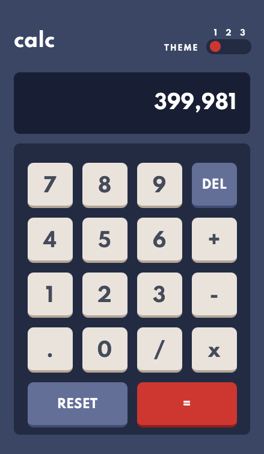

# Frontend Mentor - Calculator app solution

This is a solution to the [Calculator app challenge on Frontend Mentor](https://www.frontendmentor.io/challenges/calculator-app-9lteq5N29). Frontend Mentor challenges help you improve your coding skills by building realistic projects.

## Table of contents

-   [Overview](#overview)
    -   [The challenge](#the-challenge)
    -   [Screenshot](#screenshot)
    -   [Links](#links)
-   [My process](#my-process)
    -   [Built with](#built-with)
    -   [What I learned](#what-i-learned)
    -   [Continued development](#continued-development)
-   [Author](#author)

## Overview

### The challenge

Users should be able to:

-   See the size of the elements adjust based on their device's screen size
-   Perform mathmatical operations like addition, subtraction, multiplication, and division
-   Adjust the color theme based on their preference
-   **Bonus**: Have their initial theme preference checked using `prefers-color-scheme` and have any additional changes saved in the browser

### Screenshot

### Links

-   Solution URL: [Frontend Mentor](https://www.frontendmentor.io/solutions/calculator-with-3-theme-switcher-save-themes-and-user-preferred-theme-fxREQfkum)
-   Live Site URL: [Calculator with 3 Theme Switcher](https://calculator.scottjohnston.dev)

## My process

### Built with

-   HTML5 markup
-   CSS
-   Flexbox
-   CSS Grid
-   Mobile-first workflow
-   [React](https://reactjs.org/) - JS library
-   [Styled Components](https://styled-components.com/) - For styles

### What I learned

-   More exposure to styled components in React
-   Additional learning using Grid
-   How to implement a theme switch component for more than two themes
-   Saving data locally based on theme preferences
-   Implementing `prefers-color-scheme` to match users system preferences if no locally saved theme found
-   Breaking down functions into single areas of responsibilities

### Continued development

I plan to continue getting more familiar and experience with Styled Components along with Grid. I also need to refactor a number of areas.

## Author

-   Website - [Scott Johnston](https://www.scottjohnston.dev)
-   Frontend Mentor - [@SJ47](https://www.frontendmentor.io/profile/SJ47)
-   Twitter - [@scottJ_Dev](https://www.twitter.com/scottJ_Dev)
